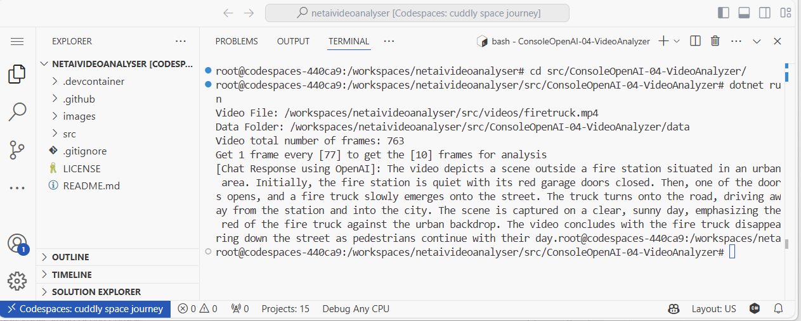
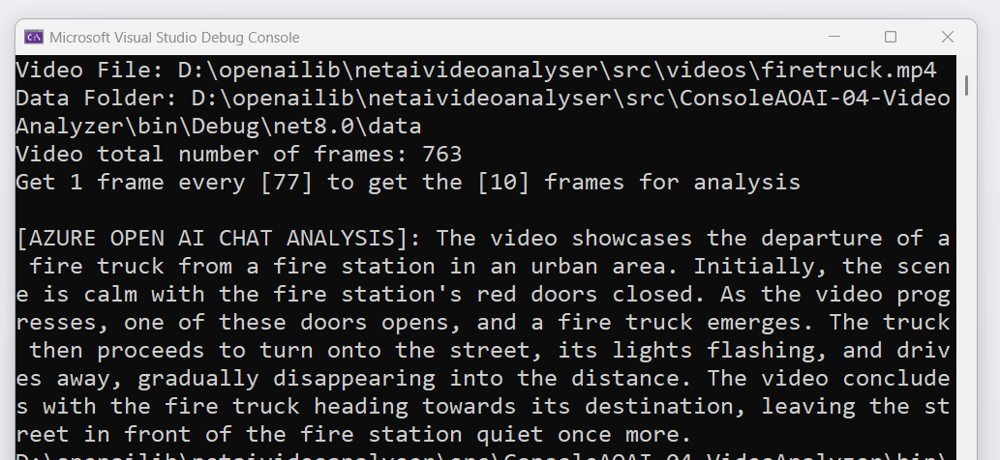
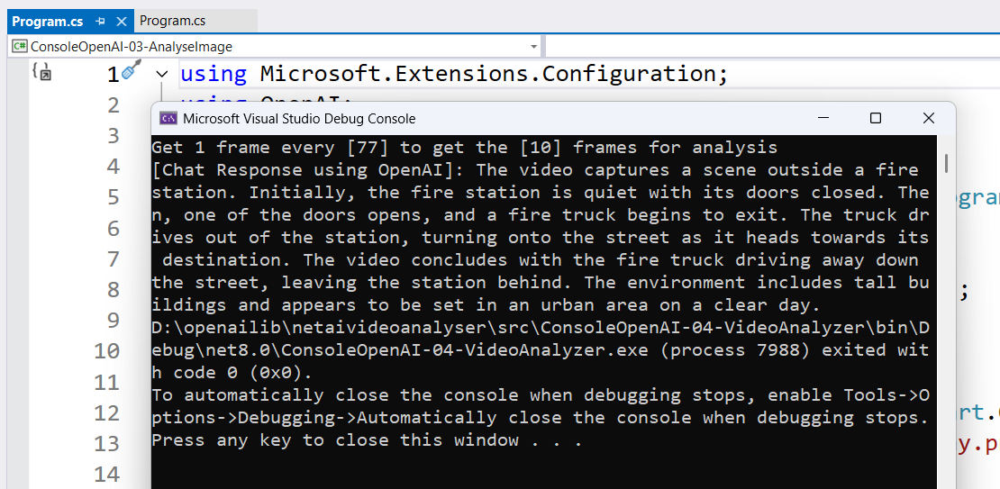
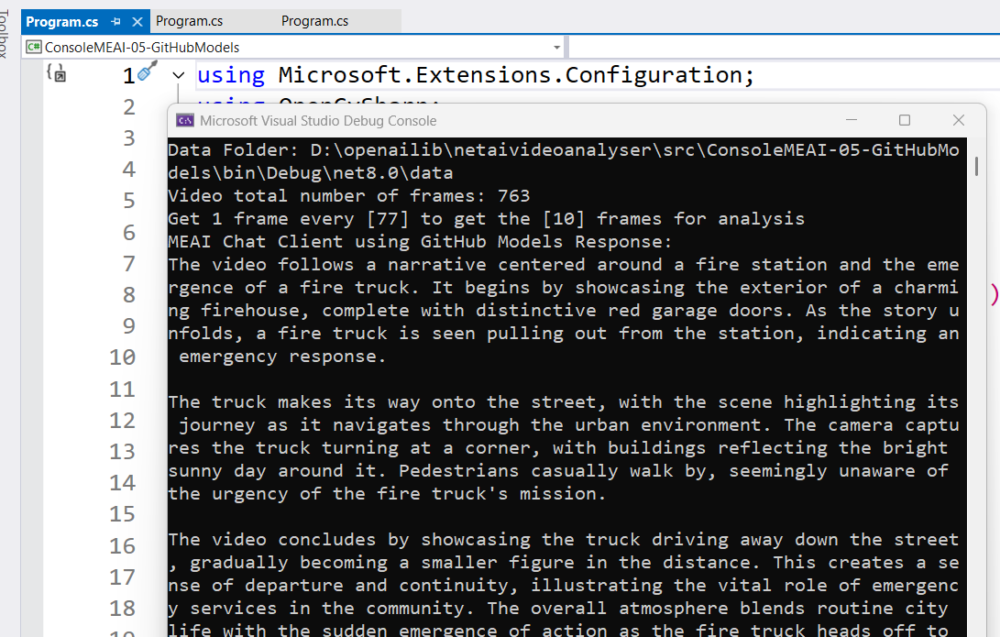

# .NET + AI - Video Analyser

## Description

[](/LICENSE)
[](https://twitter.com/elbruno)


This repository contains a series of samples on how to analyse a video using multimodal Large Language Models, like GPT-4o or GPT-4o-mini. The repository also includes samples of the use of different AI libraries like

- [Azure AI OpenAI library for .NET.](https://www.nuget.org/packages/Azure.AI.OpenAI) using **Azure OpenAI Services**
- [Microsoft.Extensions.AI.OpenAI](https://www.nuget.org/packages/Microsoft.Extensions.AI.OpenAI) using **OpenAI APIs**
- [Microsoft.Extensions.AI.AzureAIInference](https://www.nuget.org/packages/Microsoft.Extensions.AI.AzureAIInference) to work with **GitHub Models**
- [Microsoft.Extensions.AI.Ollama](https://www.nuget.org/packages/Microsoft.Extensions.AI.Ollama) to work with **Ollama** local models
- [OpenAI .NET API library](https://www.nuget.org/packages/OpenAI) to work with **OpenAI APIs**.

**CodeSpaces:** This project is designed to be opened in GitHub Codespaces as an easy way for anyone to try out this libraries entirely in the browser.

This is the OpenAI sample running in Codespaces. The sample analyze this video:


And return this output:



## Sample projects and references

The sample projects are in the folder [/src/Labs/](/src/Labs/).

Currently there are labs for:

- [OpenAI .NET SDK](https://devblogs.microsoft.com/dotnet/announcing-the-stable-release-of-the-official-open-ai-library-for-dotnet/)
- [Microsoft AI Extensions](https://devblogs.microsoft.com/dotnet/introducing-microsoft-extensions-ai-preview/)
- [GitHub Models](https://devblogs.microsoft.com/dotnet/using-github-models-and-dotnet-to-build-generative-ai-apps/)
- [Local Image analysis using Ollama](https://ollama.com/blog/vision-models)
- [OpenCV, using OpenCVSharp](https://github.com/shimat/opencvsharp)

## Video Analysis Sample Projects Overview

| Library | Project Name | Description |
|--------------|--------------|-------------|
| [OpenAI library for .NET](https://devblogs.microsoft.com/dotnet/announcing-the-stable-release-of-the-official-open-ai-library-for-dotnet/)  | `.\src\ConsoleOpenAI-04-VideoAnalyzer` | Console project  demonstrating the use of the [OpenAI .NET API library](https://www.nuget.org/packages/OpenAI) to work with **OpenAI APIs**. |
| [Azure AI OpenAI library for .NET.](https://www.nuget.org/packages/Azure.AI.OpenAI) | `.\src\ConsoleAOAI-04-VideoAnalyzer` | Console project  demonstrating the use of the stable release of [Azure AI OpenAI library for .NET.](https://www.nuget.org/packages/Azure.AI.OpenAI) using **Azure OpenAI Services** for the video analysis process.|
| [Microsoft.Extensions.AI](https://devblogs.microsoft.com/dotnet/introducing-microsoft-extensions-ai-preview/)  | `.\src\ConsoleMEAI-04-OpenAI` | Console project  demonstrating the use of the [Microsoft.Extensions.AI.OpenAI](https://www.nuget.org/packages/Microsoft.Extensions.AI.OpenAI) using **OpenAI APIs** for the video analysis process. |
| [Microsoft.Extensions.AI](https://devblogs.microsoft.com/dotnet/introducing-microsoft-extensions-ai-preview/)  | `.\src\ConsoleMEAI-05-GitHubModels` | Console project  demonstrating the use of the [Microsoft.Extensions.AI.AzureAIInference](https://www.nuget.org/packages/Microsoft.Extensions.AI.AzureAIInference) to work with **GitHub Models** |
| [Microsoft.Extensions.AI](https://devblogs.microsoft.com/dotnet/introducing-microsoft-extensions-ai-preview/)  | `.\src\ConsoleMEAI-06-Ollama` | Console project  demonstrating the use of the [Microsoft.Extensions.AI.Ollama](https://www.nuget.org/packages/Microsoft.Extensions.AI.Ollama) to work with **Ollama** local models. This sample uses [Llava 7B](https://ollama.com/library/llava) for image analysis and [Phi 3.5](https://ollama.com/library/phi3.5) for Chat completion |
| [Microsoft.Extensions.AI](https://devblogs.microsoft.com/dotnet/introducing-microsoft-extensions-ai-preview/)  | `.\src\ConsoleMEAI-07-AOAI` | Console project  demonstrating the use of the [Microsoft.Extensions.AI.AzureAIInference](https://www.nuget.org/packages/Microsoft.Extensions.AI.AzureAIInference) to work with **Azure OpenAI Services** |


## Run sample projects

To run sample projects you must 1st define the user secrets to work with the project.

### Run OpenAI .NET Library samples

In example, to run the sample using OpenAI APIs, located in `.\src\ConsoleOpenAI-04-VideoAnalyzer\`, you must set your OpenAI Key in a user secret.

- Navigating to the sample project folder using the command:

```bash
cd .\src\ConsoleOpenAI-04-VideoAnalyzer\
```

- Add the user secrets running the command:

```bash
dotnet user-secrets init
dotnet user-secrets set "OPENAI_KEY" "< your key goes here >"
```

- Run the project with the command:

```bash
dotnet run
```

- You can expect an output similar to this one:



### Run Azure OpenAI .NET Library samples

In example, to run the sample using Azure OpenAI Services, located in `.\src\ConsoleAOAI-04-VideoAnalyzer\`, you must set your Azure OpenAI keys in a user secret.

- Navigating to the sample project folder using the command:

```bash
cd .\src\ConsoleAOAI-04-VideoAnalyzer\
```

- Add the user secrets running the command:

```bash
dotnet user-secrets init
dotnet user-secrets set "AZURE_OPENAI_MODEL" "gpt-4o"
dotnet user-secrets set "AZURE_OPENAI_ENDPOINT" "https://< your service endpoint >.openai.azure.com/"
dotnet user-secrets set "< your key goes here >" 
```

- Run the project with the command:

```bash
dotnet run
```

- You can expect an output similar to this one:



### Run GitHub Models Library samples

In example, to run the sample using GitHub Models, located in `.\src\ConsoleMEAI-05-GitHubModels\`, you must set your GitHub Personal Token Access in a user secret.

- Navigating to the sample project folder using the command:

```bash
cd .\src\ConsoleMEAI-05-GitHubModels\
```

- Add the user secrets running the command:

```bash
dotnet user-secrets init
dotnet user-secrets set "GH_TOKEN" "< your PAT goes here >" 
```

- Run the project with the command:

```bash
dotnet run
```

- You can expect an output similar to this one:



### Run Ollama sample

**Instructions Coming soon!**

## Author

👤 **Bruno Capuano**

- Website: [https://elbruno.com](https://elbruno.com)
- Twitter: [@elbruno](https://twitter.com/elbruno)
- Github: [@elbruno](https://github.com/elbruno)
- LinkedIn: [@elbruno](https://linkedin.com/in/elbruno)

## 🤝 Contributing

Contributions, issues and feature requests are welcome!

Feel free to check [issues page](//issues).

## Show your support

Give a ⭐️ if this project helped you!

## 📝 License

Copyright &copy; 2024 [Bruno Capuano](https://github.com/elbruno).

This project is [MIT](/LICENSE) licensed.

***
